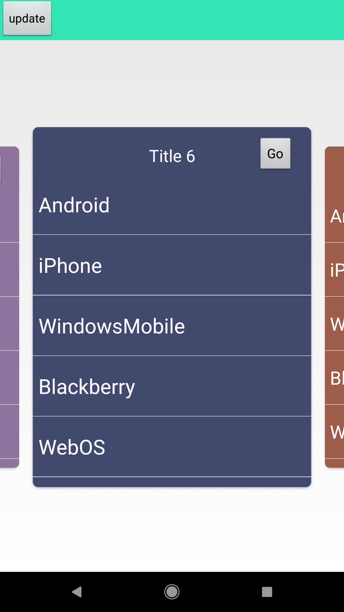

# Android-ViewPager-Carousel-UI
ViewPager Carousel Card UI can be used as Top Level Navigation or as a Image / Video  Gallery View

<!--- this is for screenshot  --->

How to Use:
1 in xml layout define your ViewPage like this

<k.k.sharma.corouselpagerkk.KKViewPager xmlns:android="http://schemas.android.com/apk/res/android"
        android:id="@+id/kk_pager"
        android:layout_width="match_parent"
        android:layout_height="match_parent" 
       />
       
2.  In your Fragment or Activity 
 mPager = (KKViewPager) findViewById(R.id.kk_pager);
 mPager.setAdapter(new TestFragmentAdapter(getSupportFragmentManager(),
                MainActivity.this, CONTENT2));
                
3. Adjust Page Spacing only if defalult(40dp) is not giving the desired result  :
you can adjust page spacing by set calling method  

mPager.setPageMargin(marging in pixels);

4. Enable/Desable scale and fading animation by calling method 
 mPager.setAnimationEnabled(true/false);
5. Enable/Desable fading by calling following method 
 mPager.setFadeEnabled(true);
 you can also configure fading factor for side cards by calling  
 mPager.setFadeFactor(0.6f);
 
 
